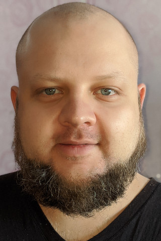

* **Location:** Kharkiv, Ukraine
* **Email:** root@yurikoles.com
* **Skype:** yurikoles
* **Mobile:** +380936939343
* **LinkedIn:** [linkedin.com/in/yurikoles](https://linkedin.com/in/yurikoles)
* **Github:** [github.com/yurikoles](https://github.com/yurikoles)
* **CodersRank:** [profile.codersrank.io/user/yurikoles](https://profile.codersrank.io/user/yurikoles)
* **Download DOC or PDF here:** [ios.yurikoles.com](https://ios.yurikoles.com)
* **View this CV in Web:** [yurikoles.com](https://yurikoles.com)

# Objective:
* Long term full-time software development contract with an open-minded company.

# Key points:
* During 9 years of my commercial iOS software development experience I had developed many apps. I started in the era of iPhone 4, iOS 4 and Objective-C with MRC. But after that I adopted many newer technologies from their very beginnings, like ARC, Swift and many others.
* During last year I also gained experience of commercial cross-platfrom (iOS + Android) mobile application development with use of Flutter framework.
* My experience includes work in companies with own products, as well as outsource companies.
* Researched, designed, architected, developed and deployed many mobile projects from scratch.
* Supported, maintained, and extended many third-party mobile apps of different scale.
* Set up and maintained CI/CD workflow for a number of mobile and server apps and services.
* During 3 years of Linux System Engineering / DevOps experience I had brought up, supported and guarantied stability and uptime of many Linux-based servers and containers/clouds.
* I don’t like routine, so I advocate and follow DRY principle in mobile development as well as in DevOps, so I always automate routine tasks with scripts, which I develop mostly for shell, but I also use Python and Ruby for that purposes.
* My experience also includes backend development with Python/Django and Ruby on Rails.

# iOS Projects:
* **Crypterium:** cryptocurrency wallet app, [apps.apple.com/app/id1360632912](https://apps.apple.com/app/id1360632912).
* **Chevron:** gas stations mobile app companion in your pocket, [apps.apple.com/us/app/id1450978468](https://apps.apple.com/us/app/id1450978468).
* **Strings:** social network based on image sharing, [apps.apple.com/us/app/id1437010577](https://apps.apple.com/us/app/id1437010577).
* **Fitplan:** fitness video lessons, [apps.apple.com/us/app/id1064119547](https://apps.apple.com/us/app/id1064119547).
* **My Beeline:** large mobile operator, [apps.apple.com/us/app/id569251594](https://apps.apple.com/us/app/id1094748370).
* **DocChat:** online consultation with doctor, [app.docchat.io](https://app.docchat.io).
* **Go Problems:** large set of Go game situations to solve, [apps.apple.com/us/app/id635778548](https://apps.apple.com/us/app/id635778548).
* **Le Bled:** helps users to learn French, [apps.apple.com/us/app/id444078131](https://apps.apple.com/us/app/id444078131).

# Flutter Projects:
* **Auto Hauls:** an app for truck drivers, that ship cars between cities. It's not released yet.

# Keywords:
Swift, Objective-C, Dart, Flutter, Python, Ruby, Xcode, UIKit (Cocoa Touch), Core Data, SQLite, JSON, XML, Plist, KVO, KVC, Blocks/Closures, Core Location, Apple MapKit, Google Maps, Core Graphics (Quartz), Core Animation, XCTest, OCMock, Facebook SDK, Git, SVN (Subversion), Jira, Redmine, Asana, Trello, AppStore (formerly iTunes) Connect (app publishing), Bluetooth beacons, OpenCV.

# Education:
* Computer Engineering Department. Donetsk National Technical University (2005 – 2009), Ukraine, [fknt.donntu.edu.ua/ki](http://fknt.donntu.edu.ua/ki/).

# Experience:
**Freelance**, Internet
July 2014 — Present, Remote/Freelance iOS Software Developer
* Developed a cross-platform mobile app in Flutter for truck drivers, that ship cars between cities. It's not released yet, [Auto Hauls](https://autohauls.com/).
* Improved cryptocurrency wallet app, [Crypterium](https://apps.apple.com/app/id1360632912).
* Improved app for gas stations, [Chevron](https://apps.apple.com/us/app/id1450978468).
* Took part in development of social network which is based on image sharing, [Strings](https://apps.apple.com/us/app/id1437010577).
* Developed fitness app, [Fitplan](https://apps.apple.com/us/app/id1064119547).
* Was solely iOS Software Developer in charge of support of app for subscribers of large mobile operator, [My Beeline](https://apps.apple.com/us/app/id1094748370).
* Took part in development of a service that allows people to get medical consultation online via text/audio/video, [DocChat](https://app.docchat.io).
* I was also involved in development of many smaller apps on different stages.

**Biruza Software**, Donetsk, [biruza.com](http://biruza.com)
August 2013 – July 2014, iOS Software Developer
* I was in a team that had developed a social network app, in which users share their shopping experience, project Bestie App.

**Go interactive!**, Kyiv, [gointeractive.co](https://gointeractive.co)
June 2012 – August 2013, iOS Software Developer
* Took part in development of a social network application, in which users exchange check-ins for discounts, project Fourcoins.

**GrandSoftStudio**, Donetsk,
June 2011 – June 2012, iOS Software Developer
* I was involved in development and support of a number iPhone and iPad applications.
* The project that is still alive: [Le BLED](https://apps.apple.com/us/app/id444078131), which helps users to learn French.

# Examples of my Swift code:
* [github.com/yurikoles/GiphySearch](https://github.com/yurikoles/GiphySearch)
* [github.com/yurikoles/CarsTest](https://github.com/yurikoles/CarsTest)

# Level of English:
* Upper-Intermediate.
